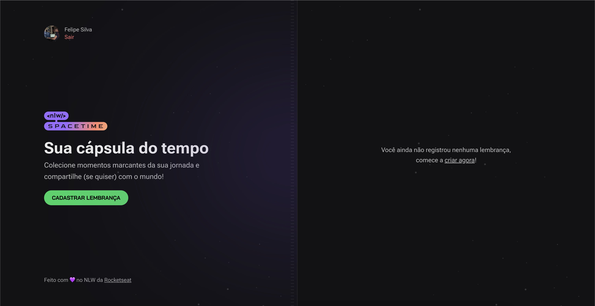

## 🚀 Spacetime

Aplicação de recordação de memórias, onde o usuário poderá adicionar à uma timeline textos, fotos e vídeos de acontecimentos marcantes da sua vida, organizados por mês e ano.



## 💻 Tecnologias

Esse projeto foi desenvolvido utilizando as tecnologias mais recentes.

- [ReactJS](https://reactjs.org/)
- [Next.js](https://nextjs.org/)
- [Typescript](https://www.typescriptlang.org/)
- [Fastify](https://www.fastify.io/)
- [Prisma](https://www.prisma.io/)
- [Expo](https://expo.dev/)


## 💻 Iniciando o projeto

### Requisitos

- Você precisa instalar o [Node.js](https://nodejs.org/en/download/) e [Yarn](https://yarnpkg.com/) para executar esse projeto.

**Clonando o projeto e acessando o diretório**

```bash
$ git clone https://github.com/FeSilva-dev/spacetime.git && cd spacetime
```

**Rodando o Back End**

```bash
# Vá para o backend
$ cd server

# Instale as dependências
$ yarn

# Rode o projeto
$ yarn dev

# O servidor iniciará na porta 3333 - url <http://localhost:3333>
```

**Rodando o Front End**

```bash
# Vá para o backend
$ cd web

# Instale as dependências
$ yarn

# Rode o projeto
$ yarn dev

# O servidor iniciará na porta 3000 - url <http://localhost:3000>
```

**Rodando o Mobile**

```bash
# Vá para o backend
$ cd mobile

# Instale as dependências
$ yarn

# Rode o projeto
$ npx expo start
```

A aplicação WEB estará disponível para acesso no navegador em: `http://localhost:3000`

Feito com ❤️ by Felipe Silva [LinkedIn](https://www.linkedin.com/in/fesilva-dev/)